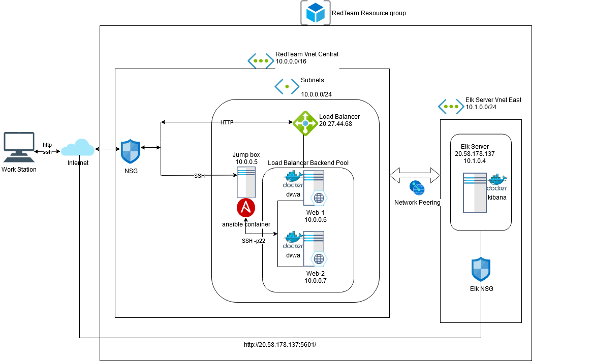

## Automated ELK Stack Deployment

The files in this repository were used to configure the network depicted below.

These files have been tested and used to generate a live ELK deployment on Azure. They can be used to either recreate the entire deployment pictured above or specific files may be used to install only certain components of the deployment, such as Filebeats.

   ![Elk-Playbook.yml]
 
This document contains the following details:
- Description of the Topologu
- Access Policies
- ELK Configuration
  - Beats in Use
  - Machines Being Monitored
- How to Use the Ansible Build

### Description of the Topology

The main purpose of this network is to expose a load-balanced and monitored instance of DVWA, the D*mn Vulnerable Web Application.

Load balancing ensures that the application will be highly available, in addition to restricting traffic to the network.
- _Load balancer prevents trafic overload on the webservers by redistributing trafic from one webserver to the other which enhances availability and productivity. Load balancer also reroutes trafic from one web server to another which provides security to the system from Destributed Denial of Service attacks. The Jump Box provides a secure administrative user access point, protecting webservers from public administrative access._

Integrating an ELK server allows users to easily monitor the vulnerable VMs for changes to the log files and system performance.
- _Filebeat monitors the log files or locations that you specify, collects log events and forwards them for indexing_
- _Metricbeat takes the statistics and metrics it has collected and ships them to the output you specify in Kibana_

The configuration details of each machine may be found below.

| Name     | Function   | IP Address | Operating System   |
|----------|------------|------------|--------------------|
| Jump Box | Gateway    | 10.0.0.5   | Linux Ubuntu 18.04 |
| Web-1    | Server     | 10.0.0.6   | Linux Ubuntu 18.04 |
| Web-2    | Server     | 10.0.0.7   | Linux Ubuntu 18.04 |
| Elk-VM   | Elk Server | 10.1.0.4   | Linux Ubuntu 18.04 |

### Access Policies

The machines on the internal network are not exposed to the public Internet. 

Only the JumpBox machine can accept connections from the Internet. Access to this machine is only allowed from the following IP addresses:
- _Personal PC Public IP_

Machines within the network can only be accessed by SSH from JumpBox VM.
- _Public IP: 20.70.9.114_
- _Private IP: 10.0.0.5_

A summary of the access policies in place can be found in the table below.

| Name       | Publicly Accessible | Allowed IP Addresses  |
|------------|---------------------|-----------------------|
| Jump Box   | Yes                 | Personal PC Public IP |
| Web-1      | No                  | 10.0.0.6              |
| Web-2      | No                  | 10.0.0.7              |
| Elk Server | Yes                 | Elk Server Public IP  |

### Elk Configuration

Ansible was used to automate configuration of the ELK machine. No configuration was performed manually, which is advantageous because a single playbook deploys multiple servers simultaneously.

The playbook implements the following tasks:
- _Install docker.io_
- _Install python-pip_
- _Install docker container_
- _Increase virtual memory of the ELK VM_
- _Download and launch docker elk container_

The following screenshot displays the result of running `docker ps` after successfully configuring the ELK instance.

### Target Machines & Beats
This ELK server is configured to monitor the following machines:
- _Web-1 Server_
- _Web-2 Server_

We have installed the following Beats on these machines:
- _filebeat-7.4.0-amd64.deb_

These Beats allow us to collect the following information from each machine:
- _Filebeat monitors the log files or locations that you specify, collects log events and forwards them for indexing_
- _Metricbeat takes the statistics and metrics it has collected and ships them to the output you specify in Kibana_ 

### Using the Playbook
In order to use the playbook, you will need to have an Ansible control node already configured. Assuming you have such a control node provisioned: 

SSH into the control node and follow the steps below:
- Copy the filebeat-config.yml file to /etc/ansible/files.
- Update the /etc/ansible/host file to include the private IP addresses of the DVWA web servers.
- Run the playbook, and navigate to http://elk-server-ip:5601/ to check that the installation worked as expected.

### Commands needed to run the ansible configurations for the Elk-Server
SSH into JumpBox from Local workstation/desktop
- _ssh azureuser@jumpbox-public-ip_

List available docker containers
- _sudo docker container list -a_

Identify and start a docker container 
- _sudo docker start compassionate_goldstine_

Attach docker container 
- _sudo docker attach comppasionate_goldstine_

Add DVWA Webservers to host file
- _nano /etc/ansible/hosts_
- _uncomment [webservers] and add the private addresses of the webservers, save and exit_

Run the ansible playbook to update the configurations
- _ansible-playbook Elk-playbook.yml_

Copy filebeat-config.yml file to /etc/ansible/files 

Run filebeat playbook
- _ansible-playbook /etc/ansible/roles/filebeat-playbook.yml_

Navigate to URL
- _http://elk-server-ip:5601/_
 
